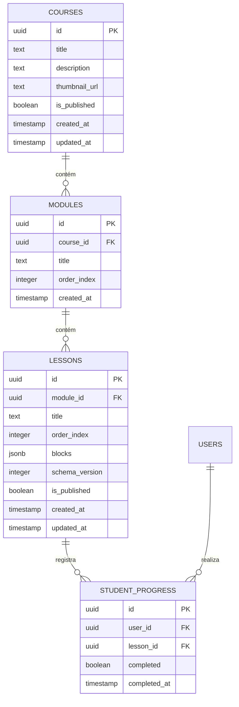

# Plano de Banco de Dados e Migrações (Supabase / PostgreSQL)

## 🎯 Objetivo
Estruturar o esquema físico de persistência relacional e flexível (JSONB) no Supabase, garantindo integridade de chaves estrangeiras, performance de busca e suporte completo a versionamento de blocos do CMS para a plataforma de cursos.

## 📐 Esquema Físico de Tabelas

### 1. Tabela: `public.courses`
Armazena a entidade raiz dos cursos cadastrados na plataforma.
* `id`: `uuid` (Primary Key, padrão `gen_random_uuid()`)
* `title`: `text` (Not Null)
* `description`: `text`
* `thumbnail_url`: `text`
* `is_published`: `boolean` (Default `false`)
* `created_at`: `timestamptz` (Default `now()`)
* `updated_at`: `timestamptz` (Default `now()`)

### 2. Tabela: `public.modules`
Armazena as divisões internas de cada curso.
* `id`: `uuid` (Primary Key)
* `course_id`: `uuid` (Foreign Key -> `courses(id)` com `on delete cascade`)
* `title`: `text` (Not Null)
* `order_index`: `integer` (Not Null, controla a ordenação visual)
* `created_at`: `timestamptz` (Default `now()`)

### 3. Tabela: `public.lessons` (CMS Core)
Esta é a tabela mais crítica, que integra a árvore de blocos dinâmicos do CMS (Texto, Vídeo, Quiz) usando uma coluna `JSONB`.
* `id`: `uuid` (Primary Key)
* `module_id`: `uuid` (Foreign Key -> `modules(id)` com `on delete cascade`)
* `title`: `text` (Not Null)
* `order_index`: `integer` (Not Null)
* `blocks`: `jsonb` (Not Null, default `'[]'::jsonb`). Contém a árvore estruturada que deve respeitar estritamente os esquemas do Zod (`TextBlockSchema`, `VideoBlockSchema`, `QuizBlockSchema`) definidos na camada de tipagem.
* `schema_version`: `integer` (Not Null, default `1`). Garante a rastreabilidade e suporte para futuras migrações ou deprecamento de propriedades de blocos do CMS.
* `is_published`: `boolean` (Default `false`)
* `created_at`: `timestamptz` (Default `now()`)
* `updated_at`: `timestamptz` (Default `now()`)

### 4. Tabela: `public.student_progress`
Registra a conclusão de aulas por cada aluno autenticado.
* `id`: `uuid` (Primary Key)
* `user_id`: `uuid` (Foreign Key -> `auth.users(id)` com `on delete cascade`)
* `lesson_id`: `uuid` (Foreign Key -> `lessons(id)` com `on delete cascade`)
* `completed`: `boolean` (Default `true`)
* `completed_at`: `timestamptz` (Default `now()`)

---

## ⚡ Estratégias de Indexação & Performance
Para garantir tempos de resposta ultrarrápidos em consultas complexas e no carregamento da árvore de blocos no mobile:
1. **Índice Estrutural:** `create index idx_modules_course_id on public.modules(course_id);`
2. **Índice de Aulas:** `create index idx_lessons_module_id on public.lessons(module_id);`
3. **Índice de Ordenação:** `create index idx_lessons_order_index on public.lessons(order_index);`
4. **Índice GIN para JSONB:** `create index idx_lessons_blocks_gin on public.lessons using gin (blocks);` (Permite buscas e filtros internos de blocos de aulas de forma extremamente performática).
5. **Índice Único de Progresso:** `create unique index idx_student_progress_user_lesson on public.student_progress(user_id, lesson_id);` (Garante que cada aluno tenha no máximo uma linha de progresso por aula).

---

## 📂 Supabase Storage Buckets
Configuração de repositórios físicos para arquivos binários:
1. **`course-media` (Privado):** Imagens, PDFs de apoio e arquivos de vídeos originais. Requer geração de URLs assinadas (signed URLs) para visualização.
2. **`course-thumbnails` (Público):** Imagens de capa de cursos e avatares de usuários. Acesso direto sem assinatura.
