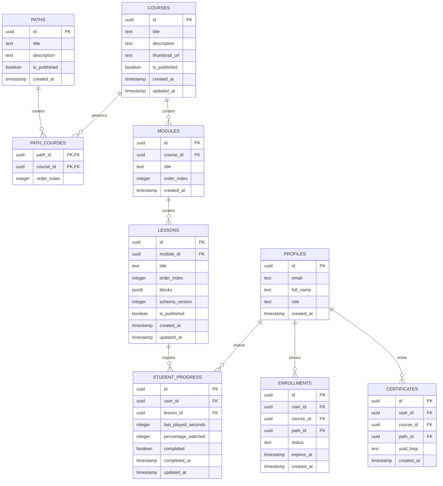

# Plano de Banco de Dados e Migrações (Supabase / PostgreSQL)

## 🎯 Objetivo
Estruturar o esquema físico de persistência relacional e flexível (JSONB) no Supabase, garantindo integridade de chaves estrangeiras, segurança robusta via Row Level Security (RLS) e suporte completo aos requisitos de progresso inteligente (auto-resume, conclusão 85% e retomada automática).

---

## 📐 Esquema Físico de Tabelas

### 1. Tabela: `public.profiles`
Armazena dados adicionais do usuário sincronizados automaticamente com `auth.users` do Supabase.
* `id`: `uuid` (Primary Key, referencia `auth.users(id)` com delete cascade)
* `email`: `text` (Not Null)
* `full_name`: `text`
* `role`: `text` (Not Null, default `'student'`, check in `('student', 'teacher', 'admin')`)
* `created_at`: `timestamptz` (Default `now()`)

### 2. Tabela: `public.paths` (Trilhas)
Agrupamento de cursos em trilhas temáticas para assinaturas estruturadas.
* `id`: `uuid` (Primary Key)
* `title`: `text` (Not Null)
* `description`: `text`
* `is_published`: `boolean` (Default `false`)
* `created_at`: `timestamptz` (Default `now()`)

### 3. Tabela: `public.path_courses`
Relação Muitos-para-Muitos (N-N) entre Trilhas e Cursos.
* `path_id`: `uuid` (PK, FK -> `paths(id)` com delete cascade)
* `course_id`: `uuid` (PK, FK -> `courses(id)` com delete cascade)
* `order_index`: `integer` (Not Null, controla a ordem dos cursos dentro da trilha)

### 4. Tabela: `public.courses`
Entidade raiz de cada curso.
* `id`: `uuid` (Primary Key)
* `title`: `text` (Not Null)
* `description`: `text`
* `thumbnail_url`: `text`
* `is_published`: `boolean` (Default `false`)
* `created_at`: `timestamptz` (Default `now()`)
* `updated_at`: `timestamptz` (Default `now()`)

### 5. Tabela: `public.enrollments`
Controle de matrículas e acessos ativos dos estudantes.
* `id`: `uuid` (Primary Key)
* `user_id`: `uuid` (FK -> `profiles(id)` com delete cascade)
* `course_id`: `uuid` (FK -> `courses(id)` com delete cascade, nullable para assinaturas de trilhas inteiras)
* `path_id`: `uuid` (FK -> `paths(id)` com delete cascade, nullable para compras de cursos avulsos)
* `status`: `text` (Not Null, default `'active'`, check in `('active', 'expired', 'canceled')`)
* `expires_at`: `timestamptz` (Nullable, indica expiração da assinatura)
* `created_at`: `timestamptz` (Default `now()`)

### 6. Tabela: `public.modules`
Divisões internas de cada curso.
* `id`: `uuid` (Primary Key)
* `course_id`: `uuid` (FK -> `courses(id)` com delete cascade)
* `title`: `text` (Not Null)
* `order_index`: `integer` (Not Null)
* `created_at`: `timestamptz` (Default `now()`)

### 7. Tabela: `public.lessons` (CMS Core)
Tabela mais crítica, integrando a árvore de blocos dinâmicos do CMS (Texto, Vídeo, Quiz) em coluna `JSONB`.
* `id`: `uuid` (Primary Key)
* `module_id`: `uuid` (FK -> `modules(id)` com delete cascade)
* `title`: `text` (Not Null)
* `order_index`: `integer` (Not Null)
* `blocks`: `jsonb` (Not Null, default `'[]'::jsonb`)
* `schema_version`: `integer` (Not Null, default `1`)
* `is_published`: `boolean` (Default `false`)
* `created_at`: `timestamptz` (Default `now()`)
* `updated_at`: `timestamptz` (Default `now()`)

### 8. Tabela: `public.student_progress`
Registra a timeline do vídeo e conclusão automática (85%) de aulas.
* `id`: `uuid` (Primary Key)
* `user_id`: `uuid` (FK -> `profiles(id)` com delete cascade)
* `lesson_id`: `uuid` (FK -> `lessons(id)` com delete cascade)
* `last_played_seconds`: `integer` (Not Null, default `0`, marca onde o vídeo parou)
* `percentage_watched`: `integer` (Not Null, default `0`, varia de 0 a 100)
* `completed`: `boolean` (Not Null, default `false`, ativado automaticamente em 85% de visualização)
* `completed_at`: `timestamptz` (Nullable)
* `updated_at`: `timestamptz` (Default `now()`)

### 9. Tabela: `public.certificates`
Geração de certificados com validação extranet.
* `id`: `uuid` (Primary Key)
* `user_id`: `uuid` (FK -> `profiles(id)` com delete cascade)
* `course_id`: `uuid` (FK -> `courses(id)` com delete cascade, nullable)
* `path_id`: `uuid` (FK -> `paths(id)` com delete cascade, nullable)
* `uuid_bsgi`: `text` (Unique, código verificador oficial com a Extranet BSGI)
* `created_at`: `timestamptz` (Default `now()`)

---

## ⚡ Estratégias de Indexação & Performance

1. **Índices Estruturais B-Tree:**
   * `idx_modules_course_id` em `modules(course_id)`
   * `idx_lessons_module_id` em `lessons(module_id)`
   * `idx_enrollments_user` em `enrollments(user_id)`
2. **Índice GIN para JSONB:**
   * `idx_lessons_blocks_gin` em `lessons using gin (blocks)`
3. **Índice Único de Progresso:**
   * `idx_student_progress_user_lesson` em `student_progress(user_id, lesson_id)` (Um único registro de progresso por aula para cada aluno).

---

## 📂 Supabase Storage Buckets
1. **`course-media` (Privado):** PDFs, imagens de aula. Requer signed URLs temporárias.
2. **`course-thumbnails` (Público):** Capas de cursos, trilhas e fotos de perfis.
