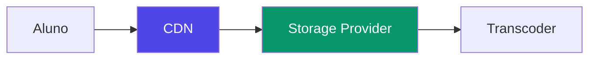

# Plano de Escalabilidade — 3k/10k+ Conexões Simultâneas

## Objetivo
Garantir que a plataforma sustainha **3.000 usuários simultâneos (média)** com picos de **10.000+** sem degradação de performance, com arquitetura preparada para escalar horizontalmente até **50.000+** no futuro.

---

## 1. Camada de Banco de Dados (Supabase/PostgreSQL)

### 1.1 Connection Pooling
| Configuração | Valor |
|---|---|
| Pool size padrão | 15 conexões por instância |
| Com PgBouncer (transaction mode) | 200+ conexões concorrentes |
| Pool mode recomendado | **Transaction mode** (conexão é devolvida após cada transação) |

### 1.2 RLS Performance
- RLS adiciona overhead em cada query — **crítico para 10k usuários**
- Diretrizes:
  - Preferir `security_invoker = true` em views
  - Evitar subqueries em RLS — usar `IN` com arrays ou joins simples
  - Índices compostos nas colunas mais filtradas por RLS (ex: `(organization_id, user_id)`)
  - Monitorar com `pg_stat_statements` queries lentas

### 1.3 Índices Obrigatórios
```sql
-- Exemplos de índices essenciais para escala
CREATE INDEX CONCURRENTLY IF NOT EXISTS idx_courses_org ON courses(organization_id);
CREATE INDEX CONCURRENTLY IF NOT EXISTS idx_enrollments_user ON enrollments(user_id, course_id);
CREATE INDEX CONCURRENTLY IF NOT EXISTS idx_lessons_course ON lessons(course_id, module_id, sort_order);
CREATE INDEX CONCURRENTLY IF NOT EXISTS idx_progress_user_lesson ON progress(user_id, lesson_id);
CREATE INDEX CONCURRENTLY IF NOT EXISTS idx_audit_logs_user ON audit_logs(user_id, created_at DESC);
```

### 1.4 Read Replicas (Futuro)
- Para 50k+: usar read replicas do Supabase para queries de relatório e catálogo
- Conexão separada para leitura (`SUPABASE_DB_URL_READER`)

---

## 2. Camada de API (Next.js)

### 2.1 Server Actions vs API Routes
| Aspecto | Server Actions | API Routes |
|---|---|---|
| Latência | Menor (sem hop HTTP) | Maior |
| Cache | Suporte nativo a `revalidate` | Via headers manuais |
| Streaming | Suporte nativo | Suporte nativo |
| **Recomendação** | **Server Actions para mutações CRUD** | **API Routes para webhooks/external calls** |

### 2.2 Edge Runtime
- Usar **Edge Runtime** para:
  - Autenticação JWT (verificação de token)
  - Rate limiting checks
  - Redirects e rewrites
  - Geocidade (CDN edge)

### 2.3 ISR para Catálogo
- Páginas de catálogo de cursos: **Incremental Static Regeneration (ISR)**
- `revalidate: 60` segundos para catálogo público
- `revalidate: 300` para páginas de curso (conteúdo menos volátil)

### 2.4 Response Caching
```typescript
// Cache headers para respostas GET públicas
export async function GET() {
  const data = await getPublicCourses();
  return Response.json(data, {
    headers: {
      'Cache-Control': 'public, s-maxage=60, stale-while-revalidate=120',
    },
  });
}
```

---

## 3. Cache Distribuído (Redis)

### 3.1 O que cachear
| Dado | TTL | Estratégia |
|---|---|---|
| Catálogo de cursos públicos | 60s | Cache-aside |
| Perfil do usuário | 300s | Write-through |
| Progresso do aluno (leitura) | 30s | Cache-aside |
| Sessão JWT | Até expirar | Write-through |
| Rate limit counters | 1s-60s | Sliding window |

### 3.2 Rate Limiting com Redis
```typescript
// Sliding window log
const key = `ratelimit:${userId}:${endpoint}`;
const current = await redis.incr(key);
if (current === 1) await redis.expire(key, 60);
if (current > 100) throw new Error('rate_limit_exceeded');
```

---

## 4. Conexões em Tempo Real (Supabase Realtime)

### 4.1 Limites e Estratégia
| Item | Limite Supabase Free/Pro | Estratégia para 10k |
|---|---|---|
| Conexões simultâneas | 500 (Pro) | **Não usar Realtime para todos** |
| Canais por conexão | 10 | Agregar notificações por canal |

### 4.2 Fallback para Escala
- **Nível 1 (3k usuários):** Realtime nativo para progresso de aula
- **Nível 2 (10k usuários):** Realtime apenas para:
  - Sincronização de progresso crítica (polling a cada 30s para o resto)
  - Notificações push (via Edge Functions + FCM/APNs)
- **Nível 3 (50k+):** Migrar para WebSocket próprio ou Socket.io + Redis adapter

---

## 5. Video Streaming

### 5.1 Arquitetura


### 5.2 Requisitos para 10k streams simultâneos
- **CDN obrigatório:** Bunny Stream, Mux ou CloudFront
- **URLs assinadas:** Expiração de 1h por sessão
- **Adaptive Bitrate (ABR):** 480p, 720p, 1080p automático
- **Cache de chunks:** CDN edge caching para chunks de vídeo

---

## 6. Mobile (Expo/React Native)

### 6.1 Offline-First para Escala
- Filas locais para ações offline (progresso, quizzes)
- Sincronização batch a cada 30s (não em tempo real)
- Cache de vídeos baixados com expiração

### 6.2 Backoff Exponencial
```typescript
async function syncProgress(attempt = 0): Promise<void> {
  try {
    await api.post('/progress', localQueue);
    localQueue.clear();
  } catch {
    if (attempt > 5) return; // desiste após 5 tentativas
    const delay = Math.min(1000 * Math.pow(2, attempt), 30000);
    setTimeout(() => syncProgress(attempt + 1), delay);
  }
}
```

---

## 7. Observabilidade para Escala

### 7.1 Métricas Essenciais
| Métrica | Onde | Alerta em |
|---|---|---|
| P95 response time | API endpoints | > 500ms |
| Conexões DB ativas | Supabase | > 80% pool |
| Rate limit hits | Redis | > 1000/min |
| Erros 5xx | API | > 1% |
| Realtime conexões | Supabase | > 80% limite |

### 7.2 Logs Estruturados
```typescript
// Formato obrigatório para todos os logs
console.log(JSON.stringify({
  level: 'error',
  service: 'admin-web',
  operation: 'create_course',
  userId: user.id,
  duration: Date.now() - start,
  error: err.message,
  requestId: crypto.randomUUID(),
}));
```

---

## 8. Plano de Execução (Tasks)

### Fase 1 — Fundação (Imediata)
- [ ] **SCL-01:** Configurar índices PostgreSQL para consultas frequentes
- [ ] **SCL-02:** Implementar rate limiting com Redis
- [ ] **SCL-03:** Adicionar cache headers em todas as rotas GET públicas
- [ ] **SCL-04:** Configurar ISR para páginas de catálogo

### Fase 2 — Otimização de Conexões (3k usuários)
- [ ] **SCL-05:** Implementar connection pooling (PgBouncer)
- [ ] **SCL-06:** Otimizar RLS policies (remover subqueries, adicionar índices)
- [ ] **SCL-07:** Estratégia de fallback Realtime-to-polling
- [ ] **SCL-08:** Backoff exponencial no mobile

### Fase 3 — Alta Escala (10k+)
- [ ] **SCL-09:** Migrar para Edge Runtime em rotas críticas
- [ ] **SCL-10:** Implementar read replicas do PostgreSQL
- [ ] **SCL-11:** WebSocket próprio para realtime (alternativa ao Supabase Realtime)
- [ ] **SCL-12:** Cache distribuído com Redis Cluster

### Fase 4 — Escala Futura (50k+)
- [ ] **SCL-13:** Auto-scaling de instâncias Next.js
- [ ] **SCL-14:** Sharding de banco de dados por organização
- [ ] **SCL-15:** CDN multi-região para vídeos
- [ ] **SCL-16:** Service Workers para cache offline avançado
